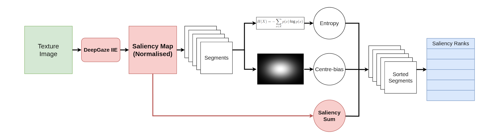
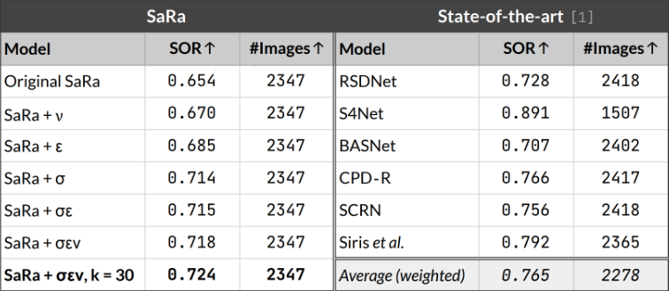
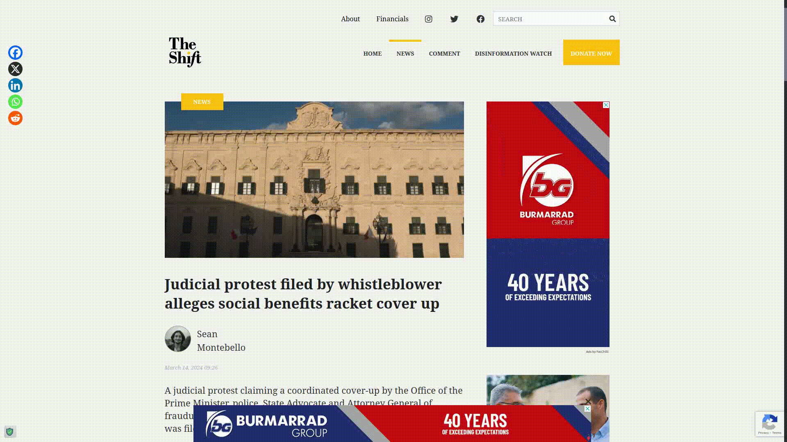
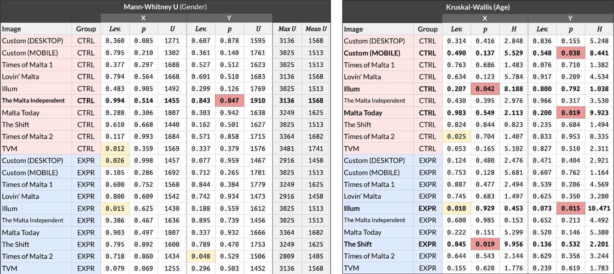
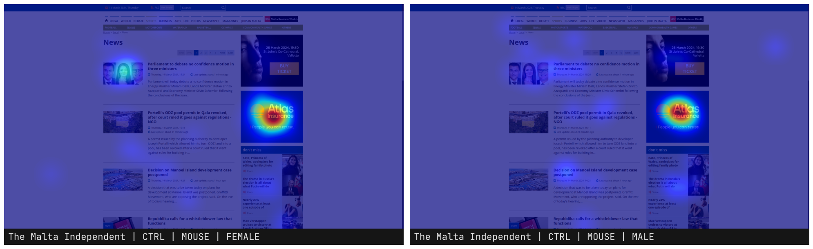
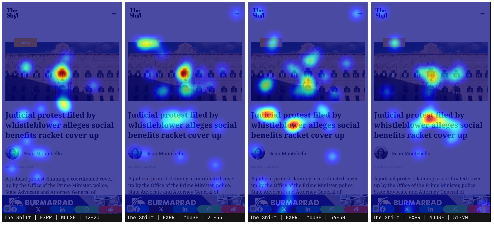
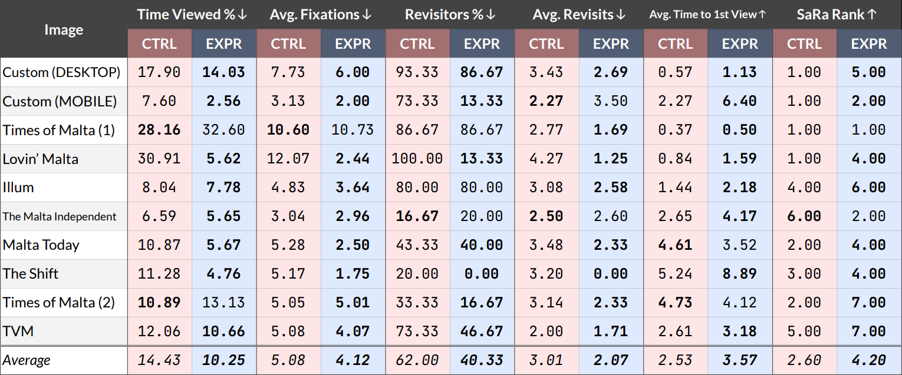
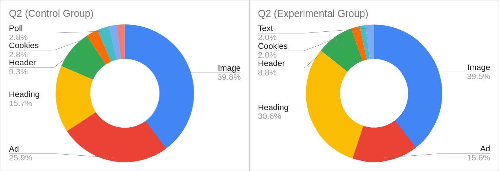

<h1>Abstract</h1>
<i>
In today’s digital age where the photograph is paramount in interest stimulation, news
outlets engage in constant competition to attract people’s attention towards
advertisements and news articles. Thus, the need for a saliency model capable of
approximating visual attention and ranking interface elements based on how much
prioritisation they garner from the human visual system is becoming ever more
prevalent.
 
 
While the application of saliency to traditional photographs has seen rapid
development in recent years, its application in the context of user interfaces has been
scarce. The aim of this project was two‐fold: (1) to optimise an existing saliency
ranking framework (SaRa) which could be used to measure attention distribution
fairness in news websites by organising interface elements into a rank hierarchy, and
(2) to curate a dataset of attention within user interfaces which indicates the extent to
which distracting elements detract from the user experience. This dataset would
subsequently be used to evaluate SaRa qualitatively.
Quantitative evaluation was carried out by assessing the optimised SaRa
framework in the task of saliency ranking on a dataset combining object masks from
MS‐COCO and fixation sequences from SALICON. It was subsequently compared to its
original version, as well as to current state‐of‐the‐art models, on the Salient Object
Ranking (SOR) metric. The proposed optimisations were found to be successful,
allowing SaRa to achieve a SOR score of 0.724, proving comparable to state‐of‐the‐art
performance and resulting in an increase of 0.07 (10.7%) when compared to the
original framework.
 
 
The saliency dataset was curated through the collection of gaze location data
within Maltese news website interfaces using an eye‐tracker as well as an online
experiment where mouse trajectories/taps were tracked. The eye‐tracking and online
experiments consisted of 30 and 363 participants respectively. Participants were split
into a control and experimental group. Each of these groups had the excessively salient
elements either included or removed, with the discrepancy between them serving as
an indicator of how distracting the excessively salient elements were.
Qualitative evaluation was carried out through a discussion comparing the
heat‐maps gathered from the experiments to the saliency rank predictions made by
SaRa. SaRa was found to work well as a framework for the assessment of attention
distribution fairness in news website user interfaces, and its saliency generator
backbone, DeepGaze IIE, accurately captured the attention observed in the
experiments.
</i>

<h1>Purpose of this study</h1>
The purpose of this study was to address two problems:
<ol>
  <li>The problem of news outlets engaging in constant competition for people’s attention, either through the use of distracting ads or News article images featuring many elements which have been shown to attract attention (e.g. faces).</li>
  <li>The lack of demographically representative datasets featuring saliency in the context of user interfaces.</li>
</ol>

<h1>Objectives</h1>
<h2>Optimise the SaRa Framework</h2>

<h2>Evaluate SaRa quantitatively</h2>

<pre><a href="https://openaccess.thecvf.com/content_CVPR_2020/html/Siris_Inferring_Attention_Shift_Ranks_of_Objects_for_Image_Saliency_CVPR_2020_paper.html">[1] Siris et al. “Inferring attention shift ranks of objects for image saliency,” in Proceedings of the IEEE/CVF conference on computer vision and pattern recognition, 2020</a></pre>

<h2>Curate an attention dataset</h2>
Available <a href="./gazedataset">here</a>.

 
 

  
  
  Example of data gathered from the eye-tracking experiment.

 
 

  
   
  <a href="https://mkenely.com/visualattention" target="_blank">Online experiment</a> used to gather mouse clicks/taps on the interfaces.

<h2>Evaluate SaRa qualitatively</h2>

<h1>Additional Notes</h1>

There was a discrepancy in terms of gender with 64% of respondents to the online experiment being female, so we carried out statistical tests to show that there weren’t significant differences in where people looked based on their gender alone.

We show that age plays a much more crucial role in influencing where people are likely to look.

  
  

  

We subsequently analysed the significant differences in gaze locations based on demographic. The following are a few examples:

  
   
  <i>The Malta Independent</i> separated by gender. Females were more likely to look at the news article image featuring Miriam Dalli.

 

  
   
  <i>The Shift</i> separated by age group. Older participants were more likely to look at the article heading rather than the image.

We compiled statistics about the regions of interest (distracting elements) and carried out a questionnaire to show that the experimental group was less distracted by irrelevant content in general:

  

  

